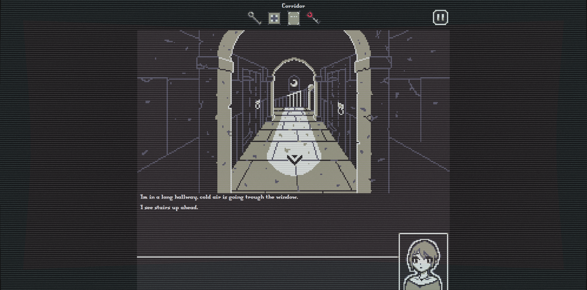

# Kidnapped: Castle Breakout

A browser-based point-and-click escape game built in TypeScript as part of a school project at HBO-ICT (Block 3).



## About

Kidnapped: Castle Breakout uses a component-based architecture with a Web Components frontend and an Express.js backend communicating over HTTPS. Players explore rooms within a castle, interact with objects, solve puzzles, and manage an inventory to ultimately escape.

The team worked within a provided game engine framework (*LucaStars Game Engine™*) and extended it with custom systems. I focused on building the interactive hitbox system, a flashlight mechanic, and minigames (like a button-mashing vomit minigame). I also took on the **Scrum Master** role, organizing sprint planning, stand-ups, and retrospectives to keep the team on track across three sprints.

**Live demo:** [point-and-click-game-api.vercel.app](https://point-and-click-game-api.vercel.app)

## Features

- Point-and-click gameplay with room exploration and puzzle solving
- Responsive hitbox system that scales across screen sizes and orientations
- Inventory management system
- Flashlight mechanic with dynamic lighting
- Interactive minigames
- CRT shader post-processing effect (scanlines, vignette, noise, RGB shift)
- Client-server architecture with Express.js backend

## Tech Stack

| Layer | Technology |
|-------|-----------|
| Language | TypeScript (99.2%) |
| Frontend | Web Components |
| Backend | Express.js (Node.js) |
| Build Tools | Vite (client), esbuild (server) |
| Deployment | Vercel |

## My Contributions

### Responsive Hitbox System
Dynamically creates invisible clickable regions over game objects on the canvas. Each hitbox scales and repositions itself based on the rendered image size, with z-index calculated from Y-position for natural depth ordering. Teammates only needed to set a position, size, and action — the hitbox system handled the rest.

### CRT Shader Effect
A full-screen post-processing shader that renders scanlines, screen curvature, vignette darkening, noise grain, flicker, and RGB chromatic aberration — all running in real-time as a transparent overlay.

### Scrum Master
Organized sprint planning, daily stand-ups, and retrospectives across three sprints to keep the team on track and deliver on time.

## Getting Started

### Prerequisites

- [Visual Studio Code](https://code.visualstudio.com/)
- [Node.js](https://nodejs.org/) (version `20.x.x`)
- [Git](https://git-scm.com/)

### Recommended VS Code Extensions

- [ESLint](https://marketplace.visualstudio.com/items?itemName=dbaeumer.vscode-eslint)
- [EditorConfig](https://marketplace.visualstudio.com/items?itemName=editorconfig.editorconfig)
- [lit-plugin](https://marketplace.visualstudio.com/items?itemName=runem.lit-plugin)

### Installation

```bash
git clone https://github.com/MEvan774/Point-and-click-game.git
cd Point-and-click-game
npm install
```

Start the server:
```bash
cd src/api
npm run dev
# API available at http://127.0.0.1:3001
```

Start the client:
```bash
cd src/web
npm run dev
# Game available at http://127.0.0.1:3000
```

## Project Structure

```
Point-and-click-game/
├── src/
│   ├── api/       # Express.js backend
│   └── web/       # Web Components frontend
├── docs/          # Project documentation
├── tsconfig.json  # TypeScript configuration
├── vercel.json    # Vercel deployment config
└── package.json
```

## What I Learned

- Component-based architecture with Web Components
- Real-time WebGL shader programming (GLSL)
- Building responsive interactive systems for canvas-based applications
- Client-server communication over HTTPS
- Scrum methodology in practice (sprint planning, stand-ups, retrospectives)
